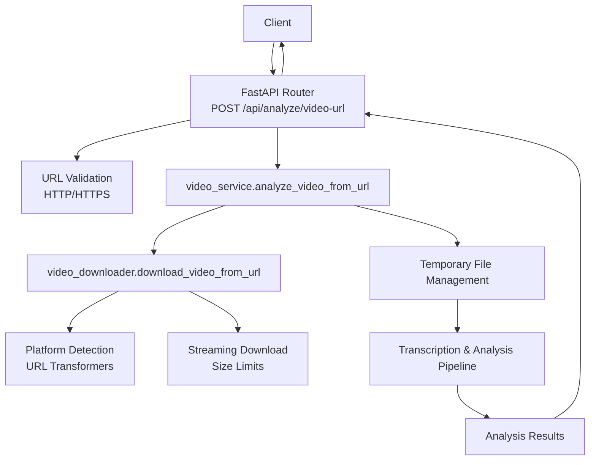
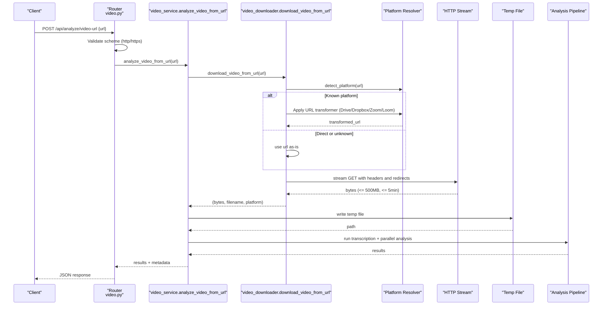
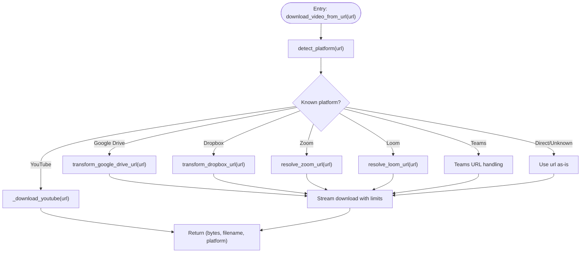
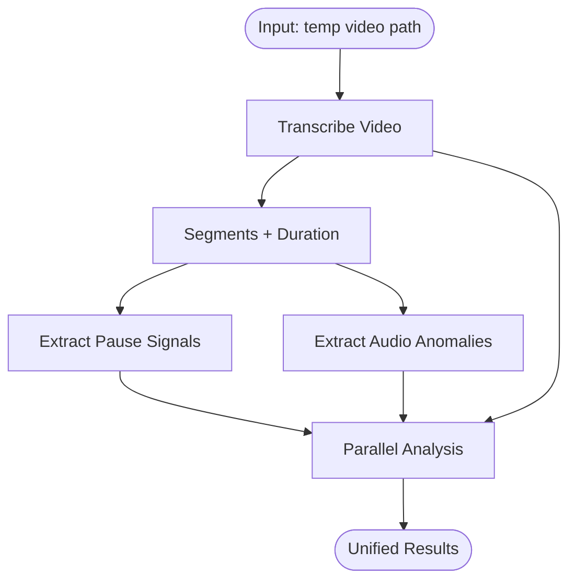
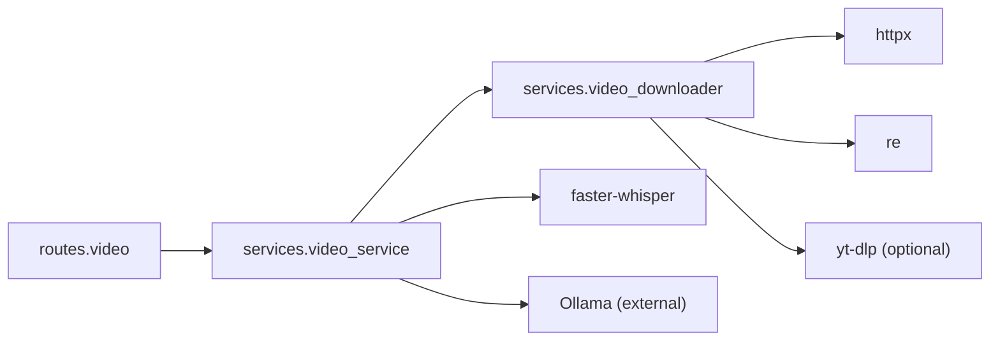

# Video URL Processing

<cite>
**Referenced Files in This Document**
- [video.py](file://app/backend/routes/video.py)
- [video_downloader.py](file://app/backend/services/video_downloader.py)
- [video_service.py](file://app/backend/services/video_service.py)
- [test_video_downloader.py](file://app/backend/tests/test_video_downloader.py)
- [test_video_routes.py](file://app/backend/tests/test_video_routes.py)
</cite>

## Table of Contents
1. [Introduction](#introduction)
2. [Project Structure](#project-structure)
3. [Core Components](#core-components)
4. [Architecture Overview](#architecture-overview)
5. [Detailed Component Analysis](#detailed-component-analysis)
6. [Dependency Analysis](#dependency-analysis)
7. [Performance Considerations](#performance-considerations)
8. [Troubleshooting Guide](#troubleshooting-guide)
9. [Conclusion](#conclusion)

## Introduction
This document explains the video URL processing functionality that enables analyzing public video recordings from platforms such as Zoom, Microsoft Teams, Google Drive, and Loom. It covers the analyze_video_from_url endpoint, URL validation requirements, supported platforms, download strategies, error handling, security considerations, and integration patterns.

## Project Structure
The video URL processing spans two layers:
- Routes: HTTP entry points and request validation
- Services: Download orchestration, platform-specific transformations, and analysis pipeline

**Diagram sources**
- [video.py:47-67](file://app/backend/routes/video.py#L47-L67)
- [video_service.py:376-397](file://app/backend/services/video_service.py#L376-L397)
- [video_downloader.py:28-46](file://app/backend/services/video_downloader.py#L28-L46)
- [video_downloader.py:125-175](file://app/backend/services/video_downloader.py#L125-L175)

**Section sources**
- [video.py:1-68](file://app/backend/routes/video.py#L1-L68)
- [video_service.py:376-397](file://app/backend/services/video_service.py#L376-L397)
- [video_downloader.py:125-175](file://app/backend/services/video_downloader.py#L125-L175)

## Core Components
- analyze_video_from_url endpoint: Validates URL scheme, delegates to the downloader, writes a temporary file, runs the analysis pipeline, and returns structured results.
- video_downloader: Detects platform, transforms URLs, streams downloads with size/timeouts, and returns bytes plus metadata.
- video_service: Orchestrates transcription and LLM-based analysis, returning a unified report.

Key behaviors:
- URL validation enforces HTTP/HTTPS scheme.
- Supported platforms include Zoom, Teams/SharePoint/OneDrive, Google Drive, Loom, Dropbox, YouTube (via yt-dlp), and direct video URLs.
- Streaming download respects a 5-minute timeout and a 500 MB cap.
- Temporary files are created and cleaned up after analysis.

**Section sources**
- [video.py:47-67](file://app/backend/routes/video.py#L47-L67)
- [video_downloader.py:28-46](file://app/backend/services/video_downloader.py#L28-L46)
- [video_downloader.py:125-175](file://app/backend/services/video_downloader.py#L125-L175)
- [video_service.py:376-397](file://app/backend/services/video_service.py#L376-L397)

## Architecture Overview
The URL processing workflow integrates route validation, platform-aware downloading, and a robust analysis pipeline.

**Diagram sources**
- [video.py:52-67](file://app/backend/routes/video.py#L52-L67)
- [video_service.py:376-397](file://app/backend/services/video_service.py#L376-L397)
- [video_downloader.py:125-175](file://app/backend/services/video_downloader.py#L125-L175)
- [video_downloader.py:178-226](file://app/backend/services/video_downloader.py#L178-L226)

## Detailed Component Analysis

### Endpoint: analyze_video_from_url
- Purpose: Accept a public URL, validate scheme, download the video, and run the full analysis pipeline.
- Validation:
  - Requires a non-empty URL starting with http:// or https://.
  - On invalid scheme, returns HTTP 400 with a descriptive message.
- Error handling:
  - ValueError raised by downstream components is caught and mapped to HTTP 422 with the error message.
  - Other exceptions are caught and mapped to HTTP 422 with a generic failure message.
- Output:
  - Returns a dictionary containing analysis results, platform label, filename, and source URL.

Integration highlights:
- Delegates to video_service.analyze_video_from_url for the download and analysis.
- Supports optional candidate_id in the request body.

**Section sources**
- [video.py:47-67](file://app/backend/routes/video.py#L47-L67)

### Service: analyze_video_from_url
- Steps:
  - Calls video_downloader.download_video_from_url to obtain bytes, filename, and platform.
  - Writes bytes to a temporary file with appropriate suffix.
  - Runs the shared analysis pipeline (_run_full_analysis) to produce a unified report.
  - Attaches source_url, platform, and filename to the result.
  - Cleans up the temporary file after completion.
- Parallelization:
  - Uses asyncio.gather to run communication and malpractice analysis concurrently after transcription.

**Section sources**
- [video_service.py:376-397](file://app/backend/services/video_service.py#L376-L397)
- [video_service.py:331-357](file://app/backend/services/video_service.py#L331-L357)

### Service: video_downloader.download_video_from_url
- Platform detection:
  - Identifies Zoom, Teams/SharePoint/OneDrive, Google Drive, Loom, Dropbox, YouTube, and direct video URLs.
- URL transformations:
  - Google Drive: Converts share/view URLs to direct download links.
  - Dropbox: Ensures dl=1 parameter for direct download.
  - Zoom: Resolves page to a direct MP4 URL using heuristics.
  - Loom: Queries the transcoded URL endpoint for CDN links.
- Download strategy:
  - Streams bytes with browser-like headers and follows redirects.
  - Enforces a 5-minute timeout and a 500 MB cap.
  - Raises ValueError with user-friendly messages for:
    - Authentication-required resources (401)
    - Access denied (403)
    - Not found/expired (404)
    - HTML responses instead of media
    - Network timeouts and request errors
- YouTube downloads:
  - Uses yt-dlp (optional dependency) to extract audio tracks and return bytes.
  - Requires yt-dlp to be installed; otherwise raises a ValueError instructing to add it.

**Diagram sources**
- [video_downloader.py:125-175](file://app/backend/services/video_downloader.py#L125-L175)
- [video_downloader.py:178-226](file://app/backend/services/video_downloader.py#L178-L226)
- [video_downloader.py:228-262](file://app/backend/services/video_downloader.py#L228-L262)

**Section sources**
- [video_downloader.py:28-46](file://app/backend/services/video_downloader.py#L28-L46)
- [video_downloader.py:64-80](file://app/backend/services/video_downloader.py#L64-L80)
- [video_downloader.py:82-98](file://app/backend/services/video_downloader.py#L82-L98)
- [video_downloader.py:101-121](file://app/backend/services/video_downloader.py#L101-L121)
- [video_downloader.py:125-175](file://app/backend/services/video_downloader.py#L125-L175)
- [video_downloader.py:178-226](file://app/backend/services/video_downloader.py#L178-L226)
- [video_downloader.py:228-262](file://app/backend/services/video_downloader.py#L228-L262)

### Analysis Pipeline (video_service)
- Transcription: Extracts transcript, segments, language, and duration.
- Pause signals: Detects suspiciously long gaps between speech segments.
- Audio anomalies: Computes counts and variance from Whisper metadata.
- Communication analysis: Sends transcript to Ollama for scores and insights.
- Malpractice analysis: Evaluates for scripted reading, background coaching, inconsistent fluency, suspicious pauses, evasive patterns, and third-party answering.
- Parallel execution: Communication and malpractice analysis run concurrently.

**Diagram sources**
- [video_service.py:25-60](file://app/backend/services/video_service.py#L25-L60)
- [video_service.py:68-117](file://app/backend/services/video_service.py#L68-L117)
- [video_service.py:127-181](file://app/backend/services/video_service.py#L127-L181)
- [video_service.py:185-298](file://app/backend/services/video_service.py#L185-L298)
- [video_service.py:331-357](file://app/backend/services/video_service.py#L331-L357)

**Section sources**
- [video_service.py:25-60](file://app/backend/services/video_service.py#L25-L60)
- [video_service.py:68-117](file://app/backend/services/video_service.py#L68-L117)
- [video_service.py:127-181](file://app/backend/services/video_service.py#L127-L181)
- [video_service.py:185-298](file://app/backend/services/video_service.py#L185-L298)
- [video_service.py:331-357](file://app/backend/services/video_service.py#L331-L357)

## Dependency Analysis
- Route depends on video_service.analyze_video_from_url.
- video_service.analyze_video_from_url depends on video_downloader.download_video_from_url.
- video_downloader uses httpx for streaming, regex for URL parsing, and optional yt-dlp for YouTube.
- video_service uses faster-whisper for transcription and httpx to communicate with Ollama.

**Diagram sources**
- [video.py:11](file://app/backend/routes/video.py#L11)
- [video_service.py:378](file://app/backend/services/video_service.py#L378)
- [video_downloader.py:9](file://app/backend/services/video_downloader.py#L9)
- [video_downloader.py:6](file://app/backend/services/video_downloader.py#L6)
- [video_downloader.py:231](file://app/backend/services/video_downloader.py#L231)

**Section sources**
- [video.py:11](file://app/backend/routes/video.py#L11)
- [video_service.py:378](file://app/backend/services/video_service.py#L378)
- [video_downloader.py:9](file://app/backend/services/video_downloader.py#L9)
- [video_downloader.py:231](file://app/backend/services/video_downloader.py#L231)

## Performance Considerations
- Streaming download with a 5-minute timeout and 500 MB cap prevents resource exhaustion.
- Concurrency: Communication and malpractice analysis run in parallel after transcription to reduce total latency.
- Temporary file management ensures cleanup even if analysis fails.
- Recommendations:
  - Prefer direct URLs when available to avoid extra HTTP hops.
  - Ensure external services (Ollama) are reachable and responsive to avoid timeouts.
  - Monitor disk space for temporary files during large downloads.

[No sources needed since this section provides general guidance]

## Troubleshooting Guide
Common issues and resolutions:
- Invalid URL scheme:
  - Symptom: HTTP 400 with a message requiring HTTP/HTTPS.
  - Resolution: Use a public URL with http:// or https://.
- Authentication-required links:
  - Symptom: ValueError indicating authentication required.
  - Resolution: Share the link as “Anyone with the link can view” without login.
- Access denied or expired:
  - Symptom: ValueError indicating access denied or not found/expired.
  - Resolution: Verify the link is public and not password-protected or deleted.
- HTML returned instead of video:
  - Symptom: ValueError instructing to ensure the recording is shared publicly and using correct platform links.
  - Resolution: Use platform-specific share links (e.g., Zoom Cloud Recordings, Teams SharePoint).
- Network timeouts:
  - Symptom: ValueError indicating download timed out.
  - Resolution: Try uploading the file directly or use a more reliable network.
- YouTube downloads:
  - Symptom: ValueError stating yt-dlp is required.
  - Resolution: Add yt-dlp to requirements and rebuild the container.

Validation and behavior are covered by tests for platform detection, URL transformations, and error scenarios.

**Section sources**
- [video.py:57-65](file://app/backend/routes/video.py#L57-L65)
- [video_downloader.py:188-199](file://app/backend/services/video_downloader.py#L188-L199)
- [video_downloader.py:202-209](file://app/backend/services/video_downloader.py#L202-L209)
- [video_downloader.py:222-225](file://app/backend/services/video_downloader.py#L222-L225)
- [test_video_downloader.py:277-282](file://app/backend/tests/test_video_downloader.py#L277-L282)
- [test_video_routes.py:140-143](file://app/backend/tests/test_video_routes.py#L140-L143)

## Conclusion
The video URL processing feature provides a secure, efficient, and user-friendly way to analyze public video recordings from major platforms. It validates URLs, resolves platform-specific links, streams downloads with strict limits, and runs a comprehensive analysis pipeline. Proper sharing settings and platform-specific links are essential for successful processing. The modular design allows for easy extension to additional platforms and improved error handling.