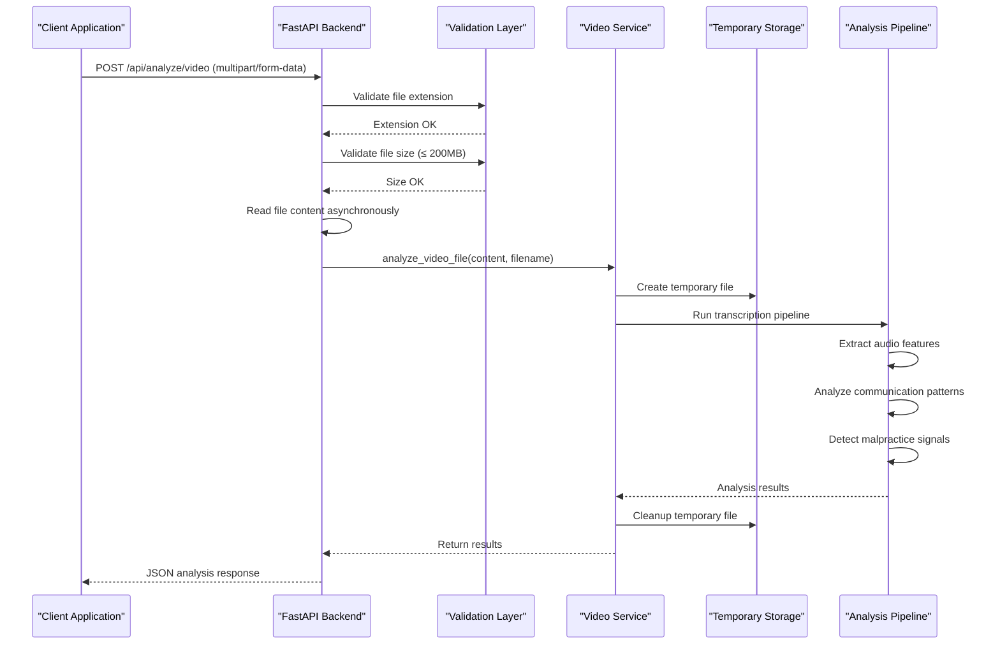
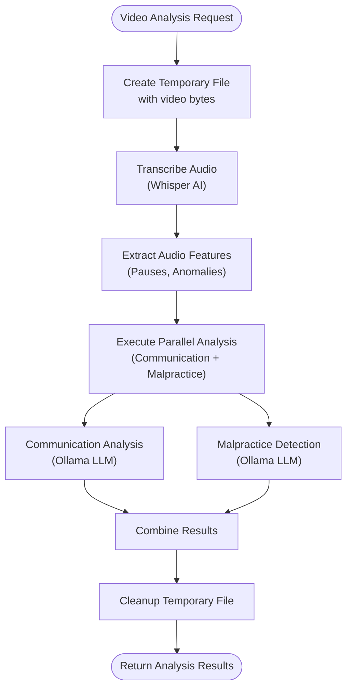

# Video Upload Handling

<cite>
**Referenced Files in This Document**
- [video.py](file://app/backend/routes/video.py)
- [video_service.py](file://app/backend/services/video_service.py)
- [auth.py](file://app/backend/middleware/auth.py)
- [video_downloader.py](file://app/backend/services/video_downloader.py)
- [test_video_routes.py](file://app/backend/tests/test_video_routes.py)
- [test_video_service.py](file://app/backend/tests/test_video_service.py)
- [VideoPage.jsx](file://app/frontend/src/pages/VideoPage.jsx)
- [requirements.txt](file://requirements.txt)
- [main.py](file://app/backend/main.py)
</cite>

## Table of Contents
1. [Introduction](#introduction)
2. [Supported Video Formats](#supported-video-formats)
3. [File Upload API Endpoints](#file-upload-api-endpoints)
4. [Validation Processes](#validation-processes)
5. [Multipart File Upload Workflow](#multipart-file-upload-workflow)
6. [Content Type Checking](#content-type-checking)
7. [Error Handling](#error-handling)
8. [Video Service Implementation](#video-service-implementation)
9. [Temporary File Handling](#temporary-file-handling)
10. [Security Considerations](#security-considerations)
11. [Integration with Authentication](#integration-with-authentication)
12. [Best Practices for Large Video Files](#best-practices-for-large-video-files)
13. [Examples and Usage Patterns](#examples-and-usage-patterns)
14. [Troubleshooting Guide](#troubleshooting-guide)
15. [Conclusion](#conclusion)

## Introduction

Resume AI's video upload handling system provides comprehensive support for analyzing video interview recordings through two primary methods: direct file upload and URL-based analysis. The system implements robust validation, secure processing, and intelligent analysis capabilities powered by advanced AI technologies including Whisper for transcription and Ollama for communication analysis.

The video analysis pipeline transforms raw video content into actionable insights for recruiters, identifying communication patterns, potential malpractice indicators, and providing detailed performance assessments.

## Supported Video Formats

The system supports the following video formats:

| Format | Extension | MIME Type |
|--------|-----------|-----------|
| MP4 Video | `.mp4` | `video/mp4` |
| WebM Video | `.webm` | `video/webm` |
| Audio Video Interleave | `.avi` | `video/avi` |
| QuickTime Movie | `.mov` | `video/quicktime` |
| Matroska Video | `.mkv` | `video/x-matroska` |
| MPEG-4 Video | `.m4v` | `video/mp4` |

**Important Note**: While `.m4v` is included in the backend validation, the frontend currently restricts uploads to `.mp4`, `.webm`, `.avi`, `.mov`, and `.mkv` formats.

**Section sources**
- [video.py:15](file://app/backend/routes/video.py#L15)
- [VideoPage.jsx:13](file://app/frontend/src/pages/VideoPage.jsx#L13)

## File Upload API Endpoints

The video upload system provides two primary endpoints:

### POST /api/analyze/video
**Purpose**: Direct file upload endpoint for video analysis

**Request Format**:
- Method: POST
- Content-Type: multipart/form-data
- Authentication: Required (Bearer token)

**Form Fields**:
- `video` (required): File upload field containing the video file
- `candidate_id` (optional): Integer ID linking analysis to a specific candidate

**Response**: JSON object containing analysis results including communication scores, malpractice assessment, and transcript information

### POST /api/analyze/video-url
**Purpose**: URL-based video analysis for public recordings

**Request Format**:
- Method: POST
- Content-Type: application/json
- Authentication: Required (Bearer token)

**JSON Body**:
```json
{
  "url": "https://example.com/video-recording",
  "candidate_id": 123
}
```

**Response**: Same JSON structure as file upload endpoint

**Section sources**
- [video.py:21-42](file://app/backend/routes/video.py#L21-L42)
- [video.py:52-67](file://app/backend/routes/video.py#L52-L67)

## Validation Processes

The system implements comprehensive validation at multiple levels:

### File Extension Validation
The backend validates file extensions against an allowed list:
- `.mp4`, `.webm`, `.avi`, `.mov`, `.mkv`, `.m4v`

### Size Limitation Validation
- Maximum upload size: 200 MB (200 × 1024 × 1024 bytes)
- Exceeding this limit triggers immediate HTTP 400 error

### Content Type Validation
While file extension validation is primary, the system also performs content-type checking to ensure the uploaded file matches the expected video format.

### URL Validation
For URL-based analysis, the system validates:
- Presence of URL field
- HTTP/HTTPS protocol requirement
- Access permissions for the recording

**Section sources**
- [video.py:15-16](file://app/backend/routes/video.py#L15-L16)
- [video.py:27-35](file://app/backend/routes/video.py#L27-L35)
- [video.py:57-58](file://app/backend/routes/video.py#L57-L58)

## Multipart File Upload Workflow

The multipart file upload process follows a structured workflow:



**Diagram sources**
- [video.py:21-42](file://app/backend/routes/video.py#L21-L42)
- [video_service.py:360-374](file://app/backend/services/video_service.py#L360-L374)

**Section sources**
- [video.py:33-42](file://app/backend/routes/video.py#L33-L42)
- [video_service.py:360-374](file://app/backend/services/video_service.py#L360-L374)

## Content Type Checking

The system implements multiple layers of content validation:

### Backend Validation
- File extension validation using tuple of allowed extensions
- Case-insensitive comparison for file extensions
- Immediate rejection for unsupported formats

### Frontend Validation
The React frontend provides real-time validation:
- Accepts only specified MIME types for each format
- Visual feedback for invalid file types
- Clear error messages for rejected files

### Runtime Validation
During processing, the system:
- Reads file content asynchronously
- Validates against size limits
- Ensures proper video format compliance

**Section sources**
- [video.py:27-31](file://app/backend/routes/video.py#L27-L31)
- [VideoPage.jsx:534-538](file://app/frontend/src/pages/VideoPage.jsx#L534-L538)

## Error Handling

The system implements comprehensive error handling across all validation and processing stages:

### Validation Errors
- **Unsupported file type**: HTTP 400 with specific error message
- **File too large**: HTTP 400 with size limitation message
- **Missing authentication**: HTTP 401 for unauthenticated requests

### Processing Errors
- **Analysis failures**: HTTP 422 with detailed error information
- **URL download failures**: HTTP 422 with specific error messages
- **Network timeouts**: HTTP 422 with timeout information

### Error Response Format
All errors return standardized JSON:
```json
{
  "detail": "Descriptive error message"
}
```

**Section sources**
- [video.py:28-40](file://app/backend/routes/video.py#L28-L40)
- [video.py:62-65](file://app/backend/routes/video.py#L62-L65)
- [test_video_routes.py:51-67](file://app/backend/tests/test_video_routes.py#L51-L67)

## Video Service Implementation

The `analyze_video_file` function serves as the core processing engine:

### Function Signature
```python
async def analyze_video_file(video_bytes: bytes, filename: str) -> dict:
```

### Processing Pipeline
1. **File Extension Detection**: Extracts file extension for proper temporary file creation
2. **Temporary File Creation**: Creates temporary file with appropriate extension
3. **Content Writing**: Writes video bytes to temporary file
4. **Analysis Execution**: Runs complete analysis pipeline
5. **Cleanup**: Removes temporary file regardless of processing outcome

### Analysis Pipeline Components
The system executes a sophisticated analysis pipeline:



**Diagram sources**
- [video_service.py:331-357](file://app/backend/services/video_service.py#L331-L357)
- [video_service.py:360-374](file://app/backend/services/video_service.py#L360-L374)

**Section sources**
- [video_service.py:360-374](file://app/backend/services/video_service.py#L360-L374)
- [video_service.py:331-357](file://app/backend/services/video_service.py#L331-L357)

## Temporary File Handling

The system implements robust temporary file management:

### Creation Process
- Uses `tempfile.NamedTemporaryFile` with automatic deletion flag
- Preserves original file extension for proper media handling
- Creates unique temporary file paths

### Processing Lifecycle
1. **Creation**: Temporary file created with video content
2. **Analysis**: Video processed using temporary file path
3. **Cleanup**: Temporary file deleted in finally block
4. **Error Recovery**: Cleanup executed even if analysis fails

### Security Measures
- Automatic cleanup prevents disk space accumulation
- Unique temporary file names prevent conflicts
- Proper exception handling ensures cleanup occurs

**Section sources**
- [video_service.py:362-373](file://app/backend/services/video_service.py#L362-L373)

## Security Considerations

The video upload system implements several security measures:

### Authentication Integration
- Requires valid JWT bearer token for all video operations
- User context validated against database
- Session-based authentication enforced

### File Validation
- Strict extension filtering prevents malicious file types
- Size limits prevent resource exhaustion attacks
- Content-type verification adds additional security layer

### Temporary File Security
- Secure temporary file creation with random names
- Automatic cleanup prevents persistence of sensitive data
- Proper file permissions maintained

### URL Security
- Public URL access verification
- Platform-specific URL transformations
- Network-level security for external downloads

**Section sources**
- [auth.py:19-40](file://app/backend/middleware/auth.py#L19-L40)
- [video.py:25](file://app/backend/routes/video.py#L25)

## Integration with Authentication

The video upload system integrates seamlessly with the authentication middleware:

### Authentication Flow
1. **Token Extraction**: Bearer token extracted from Authorization header
2. **Token Validation**: JWT decoded and validated against secret key
3. **User Lookup**: User retrieved from database with active status check
4. **Request Processing**: Analysis proceeds with authenticated user context

### Tenant Isolation
While the current implementation focuses on user authentication, the system architecture supports multi-tenancy through:
- User-based access control
- Database-level tenant separation
- Future expansion for tenant-specific policies

### Error Handling
- Invalid or expired tokens: HTTP 401 Unauthorized
- User not found: HTTP 401 Unauthorized
- Missing authentication: HTTP 401 Unauthorized

**Section sources**
- [auth.py:19-40](file://app/backend/middleware/auth.py#L19-L40)

## Best Practices for Large Video Files

### File Preparation
- **Compression**: Use appropriate compression settings for optimal quality/size balance
- **Resolution**: Consider resolution trade-offs between quality and processing time
- **Duration**: Break long interviews into smaller segments when possible

### Upload Strategies
- **Direct Upload**: Preferred for files under 200MB
- **URL Analysis**: Use for large files hosted on supported platforms
- **Chunked Uploads**: Not currently implemented; consider alternative approaches

### Performance Optimization
- **Network Stability**: Ensure stable internet connection for large uploads
- **Processing Time**: Allow 1-4 minutes for analysis completion
- **Parallel Processing**: System automatically parallelizes communication and malpractice analysis

### Storage Considerations
- **Temporary Storage**: System uses local temporary files during processing
- **Cleanup**: Automatic cleanup prevents storage accumulation
- **External Storage**: Consider cloud storage integration for persistent analysis results

## Examples and Usage Patterns

### Direct File Upload Example
```javascript
// JavaScript example for file upload
const formData = new FormData();
formData.append('video', fileInput.files[0]);
formData.append('candidate_id', 123);

fetch('/api/analyze/video', {
  method: 'POST',
  headers: {
    'Authorization': 'Bearer YOUR_JWT_TOKEN'
  },
  body: formData
})
.then(response => response.json())
.then(data => console.log('Analysis results:', data));
```

### URL Analysis Example
```javascript
// JavaScript example for URL analysis
fetch('/api/analyze/video-url', {
  method: 'POST',
  headers: {
    'Content-Type': 'application/json',
    'Authorization': 'Bearer YOUR_JWT_TOKEN'
  },
  body: JSON.stringify({
    url: 'https://zoom.us/rec/share/example',
    candidate_id: 123
  })
})
.then(response => response.json())
.then(data => console.log('Analysis results:', data));
```

### Error Handling Examples
Common error scenarios and their handling:

1. **Unsupported Format**: Returns HTTP 400 with specific error message
2. **File Too Large**: Returns HTTP 400 with size limitation message  
3. **Authentication Required**: Returns HTTP 401 for unauthorized requests
4. **Analysis Failure**: Returns HTTP 422 with detailed error information

**Section sources**
- [test_video_routes.py:69-100](file://app/backend/tests/test_video_routes.py#L69-L100)
- [test_video_routes.py:116-126](file://app/backend/tests/test_video_routes.py#L116-L126)

## Troubleshooting Guide

### Common Issues and Solutions

#### File Upload Problems
- **Issue**: "Unsupported file type" error
  - **Solution**: Verify file extension is in allowed list (.mp4, .webm, .avi, .mov, .mkv, .m4v)
  - **Verification**: Check file extension and MIME type

- **Issue**: "Video too large" error (200MB limit)
  - **Solution**: Compress video or use URL analysis for larger files
  - **Alternative**: Break video into smaller segments

#### Authentication Issues
- **Issue**: HTTP 401 Unauthorized errors
  - **Solution**: Ensure valid JWT bearer token is included in Authorization header
  - **Verification**: Check token validity and expiration

#### Analysis Failures
- **Issue**: HTTP 422 errors during analysis
  - **Solution**: Check Ollama service availability and model readiness
  - **Debugging**: Use `/health` and `/api/llm-status` endpoints

#### Network Issues
- **Issue**: Timeout during upload or analysis
  - **Solution**: Improve network connection or use URL analysis
  - **Alternative**: Reduce video size or complexity

### Debugging Endpoints
- **Health Check**: GET `/health` - Verifies database and Ollama connectivity
- **LLM Status**: GET `/api/llm-status` - Diagnoses model availability and readiness

**Section sources**
- [main.py:228-259](file://app/backend/main.py#L228-L259)
- [main.py:262-326](file://app/backend/main.py#L262-L326)

## Conclusion

Resume AI's video upload handling system provides a robust, secure, and efficient solution for analyzing video interview recordings. The system combines comprehensive validation, secure processing, and intelligent analysis capabilities to deliver actionable insights for recruitment teams.

Key strengths include:
- **Multi-format Support**: Comprehensive video format compatibility
- **Robust Validation**: Multi-layered validation prevents security issues
- **Secure Processing**: Temporary file management and cleanup ensure data safety
- **Intelligent Analysis**: Advanced AI-powered communication and malpractice detection
- **Scalable Architecture**: Designed for future expansion and enhancement

The system's architecture supports both direct file uploads and URL-based analysis, providing flexibility for different use cases and file sizes. With proper implementation of the security measures and best practices outlined above, organizations can effectively leverage video analysis capabilities while maintaining data security and system reliability.

Future enhancements could include expanded format support, improved error handling, and enhanced tenant isolation features to further strengthen the system's capabilities.