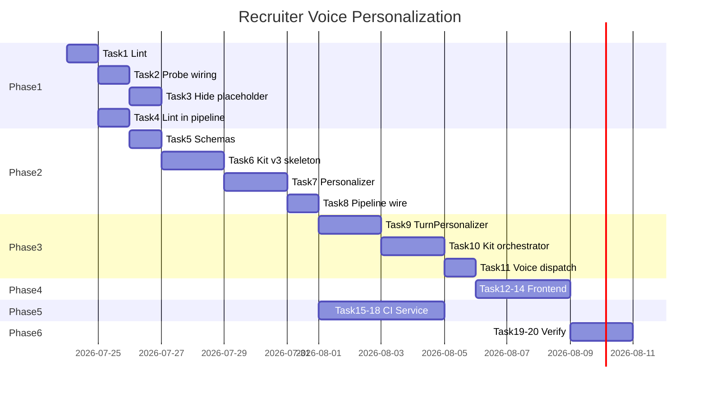

# Recruiter Voice Personalization — Full Implementation Plan

> **For agentic workers:** REQUIRED SUB-SKILL: Use superpowers:subagent-driven-development (recommended) or superpowers:executing-plans to implement this plan task-by-task. Steps use checkbox (`- [ ]`) syntax for tracking.

**Goal:** Replace template-sounding interview kits and voice screens with senior-recruiter-quality personalized questions using kit v3, batch personalization, hybrid in-call follow-ups, and a persisted candidate intelligence artifact.

**Architecture:** Build `CandidateIntelligenceService` after Python screening phase; generate thread skeletons from hypotheses + probe areas; run `RecruiterVoicePersonalizer` (batch LLM) to produce `spoken_text`/`intent`; lint kits before persist; voice bot uses pre-generated lines plus `TurnPersonalizer` for follow-ups/transitions only.

**Tech Stack:** Python 3.11 / FastAPI backend, React frontend, existing `app_llm_client` + `invoke_llm_json_resilient`, voice agent (`kit_orchestrator.py`), pytest.

## Global Constraints

- **Backward compatible:** All kit consumers must use `step.get("spoken_text") or step.get("text", "")`.
- **Kit version:** Bump to `kit_version: 3`; v2 kits continue to work via fallback helpers.
- **No full dynamic voice path:** Keep `KitDrivenOrchestrator` as spine; LLM in-call only for follow-ups/transitions.
- **Max spoken line length:** 200 characters (existing `MAX_QUESTION_LEN`).
- **In-call LLM budget:** ~300 tokens per follow-up; timeout 15s; temperature 0.35.
- **Do not commit** unless user explicitly requests (per user git rules).
- **Tests required** for each new module before marking task complete.

**Design spec:** `docs/superpowers/specs/2026-07-23-recruiter-voice-personalization-design.md`

---

## File Map

| File | Responsibility |
|------|----------------|
| `app/backend/services/candidate_intelligence_service.py` | Build + persist CI artifact |
| `app/backend/services/interview_kit_quality.py` | Anti-template lint + auto-fix hints |
| `app/backend/services/recruiter_voice_personalizer.py` | Batch LLM rewrite of kit steps |
| `app/voice_agent/turn_personalizer.py` | In-call follow-up phrasing |
| `app/backend/services/interview_kit_generator.py` | Skeleton threads + v3 fields |
| `app/backend/services/background_enrichment.py` | Pipeline orchestration |
| `app/backend/services/kit_strategy.py` | Probe-priority sorting |
| `app/backend/services/interview_kit_loader.py` | Flatten `spoken_text` for voice |
| `app/voice_agent/kit_orchestrator.py` | TurnPersonalizer integration |
| `app/backend/models/schemas.py` | Pydantic v3 fields |
| `app/frontend/src/lib/liveScreenKitUtils.js` | v3 detection + display helpers |
| `app/frontend/src/components/InterviewStrategyPreview.jsx` | Intent + spoken_text UI |
| `alembic/versions/062_candidate_intelligence.py` | DB column migration |

---

## Phase 1 — Quick Wins (Stop Template UX)

### Task 1: Kit quality lint module

**Files:**
- Create: `app/backend/services/interview_kit_quality.py`
- Create: `app/backend/tests/test_interview_kit_quality.py`

**Interfaces:**
- Produces: `lint_interview_kit(kit: dict) -> LintResult` where `LintResult = { "ok": bool, "issues": list[dict], "score": int }`
- Produces: `FORBIDDEN_STEMS: tuple[str, ...]`

- [ ] **Step 1: Write failing tests**

```python
# app/backend/tests/test_interview_kit_quality.py
from app.backend.services.interview_kit_quality import lint_interview_kit, FORBIDDEN_STEMS

def test_flags_repeated_walk_me_through():
    kit = {
        "kit_version": 3,
        "threads": [{
            "steps": [
                {"text": "Walk me through your SAP work."},
                {"text": "Walk me through your team setup."},
            ]
        }],
    }
    result = lint_interview_kit(kit)
    assert result["ok"] is False
    assert any("walk me through" in i["message"].lower() for i in result["issues"])

def test_flags_this_role_needs_stem():
    kit = {"threads": [{"steps": [{"text": "This role needs Kubernetes in production."}]}]}
    result = lint_interview_kit(kit)
    assert result["ok"] is False

def test_passes_personalized_question():
    kit = {
        "threads": [{
            "steps": [{
                "text": "At Acme you ran the S/4 cutover — what did you personally own through go-live?",
            }]
        }],
    }
    result = lint_interview_kit(kit)
    assert result["ok"] is True
```

- [ ] **Step 2: Run test — expect FAIL**

Run: `pytest app/backend/tests/test_interview_kit_quality.py -v`  
Expected: `ModuleNotFoundError`

- [ ] **Step 3: Implement lint module**

```python
# app/backend/services/interview_kit_quality.py
from __future__ import annotations
import re
from typing import Any

FORBIDDEN_STEMS = (
    "this role needs",
    "the role calls for",
    "describe a production scenario",
)
MAX_SPOKEN_LEN = 200
MIN_SPOKEN_LEN = 8

def _iter_steps(kit: dict[str, Any]):
    for thread in kit.get("threads") or []:
        for step in thread.get("steps") or []:
            if isinstance(step, dict):
                yield step
    for key in ("technical_questions", "behavioral_questions", "experience_deep_dive_questions"):
        for step in kit.get(key) or []:
            if isinstance(step, dict):
                yield step

def lint_interview_kit(kit: dict[str, Any]) -> dict[str, Any]:
    issues: list[dict[str, str]] = []
    stems_seen: dict[str, int] = {}

    for step in _iter_steps(kit):
        text = (step.get("spoken_text") or step.get("text") or "").strip()
        lower = text.lower()
        if not text:
            issues.append({"severity": "error", "message": "Empty question text"})
            continue
        if len(text) > MAX_SPOKEN_LEN:
            issues.append({"severity": "error", "message": f"Question too long ({len(text)} chars)"})
        if len(text.split()) < MIN_SPOKEN_LEN:
            issues.append({"severity": "warn", "message": "Question very short"})
        for stem in FORBIDDEN_STEMS:
            if stem in lower:
                issues.append({"severity": "error", "message": f"Forbidden stem: {stem}"})
        first_three = " ".join(lower.split()[:3])
        stems_seen[first_three] = stems_seen.get(first_three, 0) + 1

    for stem, count in stems_seen.items():
        if count > 1 and stem.startswith("walk me"):
            issues.append({"severity": "error", "message": f"Repeated stem '{stem}' ({count}x)"})

    errors = [i for i in issues if i["severity"] == "error"]
    score = max(0, 100 - len(errors) * 20 - len(issues) * 5)
    return {"ok": len(errors) == 0, "issues": issues, "score": score}
```

- [ ] **Step 4: Run tests — expect PASS**

Run: `pytest app/backend/tests/test_interview_kit_quality.py -v`

---

### Task 2: Wire probe_areas + resume anchors into kit context

**Files:**
- Modify: `app/backend/services/background_enrichment.py` (`build_llm_prompt_context`)
- Modify: `app/backend/services/interview_kit_generator.py` (`generate_targeted_interview_kit`, `_build_briefing`)
- Create: `app/backend/services/interview_kit_context.py` (extract shared anchor builder if not exists — extend `load_kit_inputs_for_screening`)
- Test: `app/backend/tests/test_interview_kit_generator.py`

**Interfaces:**
- Consumes: `probe_areas: list[dict]` from context
- Produces: `resume_anchors` block in LLM ctx: `{ latest_company, latest_title, tenure_hint, work_entries[:2] }`

- [ ] **Step 1: Add test for briefing using company name**

```python
def test_briefing_references_company_not_generic(client=None):
    from app.backend.services.interview_kit_generator import generate_targeted_interview_kit
    kit = generate_targeted_interview_kit(
        profile={"name": "Jane Doe", "current_company": "Acme Corp", "current_role": "SAP Consultant", "total_effective_years": 8},
        jd_analysis={"role_title": "SAP MM Lead", "required_skills": ["SAP MM"]},
        skill_analysis={"matched_required": ["SAP MM"], "missing_required": ["IDoc"]},
        parsed_data={"work_experience": [{"company": "Acme Corp", "title": "SAP Consultant", "duration": "2020-2024"}]},
        kit_inputs={"probe_areas": [{"category": "skill_validation", "priority": "high", "skill": "IDoc", "reasoning": "Missing IDoc"}]},
    )
    briefing = kit["candidate_briefing"]
    probe_text = " ".join(briefing["areas_to_probe"]).lower()
    assert "acme" in probe_text or "idoc" in probe_text
    assert "confirm depth on" not in probe_text  # old template stem
```

- [ ] **Step 2: Implement `_build_resume_anchors()` helper**

Add to `interview_kit_generator.py` or new `interview_kit_context.py`:

```python
def build_resume_anchors(profile: dict, parsed_data: dict | None, probe_areas: list | None) -> dict:
    work = (parsed_data or {}).get("work_experience") or profile.get("work_experience") or []
    latest = work[0] if work else {}
    return {
        "name": (profile.get("name") or "Candidate").split()[0],
        "current_company": profile.get("current_company") or latest.get("company") or "",
        "current_role": profile.get("current_role") or latest.get("title") or "",
        "latest_roles": [
            {"company": e.get("company", ""), "title": e.get("title", ""), "duration": e.get("duration", "")}
            for e in work[:2] if isinstance(e, dict)
        ],
        "probe_areas": probe_areas or [],
    }
```

- [ ] **Step 3: Update `_build_briefing()` to use anchors + probe_areas**

Replace template strength lines with:
```python
f"At {company}, verify {skill} — resume shows it but match confidence is low"
```
when probe category is `skill_validation`.

- [ ] **Step 4: Extend `build_llm_prompt_context()` with `resume_anchors_text` and `probe_areas_text`**

Append to prompt ctx dict returned by `build_llm_prompt_context`.

- [ ] **Step 5: Run tests**

Run: `pytest app/backend/tests/test_interview_kit_generator.py -v`

---

### Task 3: Hide placeholder kit until ready

**Files:**
- Modify: `app/backend/services/hybrid_pipeline.py` (`_placeholder_interview_kit`)
- Modify: `app/frontend/src/lib/enrichmentUtils.js` or `liveScreenKitUtils.js`
- Modify: `app/frontend/src/components/patterns/EnrichmentBanner.jsx`
- Test: `app/frontend/src/lib/enrichmentUtils.test.js`

**Interfaces:**
- Produces: placeholder kit with `"kit_status": "pending"` and empty `threads`
- Frontend: `isKitReady(kit, status)` → boolean

- [ ] **Step 1: Add frontend test**

```javascript
// enrichmentUtils.test.js
import { isInterviewKitReady } from './enrichmentUtils'

test('returns false when kit_status is processing', () => {
  expect(isInterviewKitReady({ threads: [] }, 'processing')).toBe(false)
})

test('returns true when status ready and threads present', () => {
  expect(isInterviewKitReady({ kit_version: 2, threads: [{ steps: [{}] }] }, 'ready')).toBe(true)
})
```

- [ ] **Step 2: Implement `isInterviewKitReady` helper**

```javascript
export function isInterviewKitReady(kit, status) {
  if (status === 'processing' || status === 'pending') return false
  if (!kit) return false
  const hasThreads = kit.kit_version >= 2 && Array.isArray(kit.threads) && kit.threads.length > 0
  const hasLegacy = ['technical_questions', 'experience_deep_dive_questions'].some(
    (k) => Array.isArray(kit[k]) && kit[k].length > 0
  )
  return hasThreads || hasLegacy
}
```

- [ ] **Step 3: Update analyze placeholder to set `kit_status: "pending"` and minimal shell**

In `_placeholder_interview_kit`, return `{ kit_version: 2, kit_status: "pending", threads: [], candidate_briefing: { profile_snapshot: "Generating personalized screen…" } }` instead of full deterministic kit.

- [ ] **Step 4: Update UI components to show generating state**

Use `isInterviewKitReady` in kit display components; show spinner copy when false.

- [ ] **Step 5: Run frontend tests**

Run: `npm test -- enrichmentUtils.test.js` (from `app/frontend`)

---

### Task 4: Integrate lint into background kit pipeline

**Files:**
- Modify: `app/backend/services/background_enrichment.py` (`background_interview_kit`)

- [ ] **Step 1: After LLM kit generation, run lint; on failure re-run personalizer or fall back to deterministic + lint**

```python
from app.backend.services.interview_kit_quality import lint_interview_kit

lint = lint_interview_kit(interview_questions)
if not lint["ok"]:
    log.warning("Kit lint failed score=%s issues=%s", lint["score"], lint["issues"][:3])
    # Phase 2 will add personalizer retry; for now fall back to deterministic
    interview_questions = _placeholder_interview_kit(python_result)
```

- [ ] **Step 2: Add test in `test_background_enrichment_split.py` mocking lint failure path**

- [ ] **Step 3: Run backend tests**

Run: `pytest app/backend/tests/test_background_enrichment_split.py app/backend/tests/test_interview_kit_quality.py -v`

---

## Phase 2 — RecruiterVoicePersonalizer + Kit v3

### Task 5: Extend Pydantic schemas for v3 step fields

**Files:**
- Modify: `app/backend/models/schemas.py`

- [ ] **Step 1: Extend `InterviewQuestion` model**

```python
class ProbeTarget(BaseModel):
    type: str = ""
    skill: str = ""
    company: str = ""
    hypothesis_id: str = ""
    probe_category: str = ""

class InterviewQuestion(BaseModel):
    text: str
    spoken_text: Optional[str] = None
    intent: Optional[str] = None
    probe_target: Optional[ProbeTarget] = None
    what_to_listen_for: List[str] = []
    follow_ups: List[str] = []
    follow_up_intents: List[str] = []
    scoring_criteria: Optional[ScoringCriteria] = None

    def spoken_line(self) -> str:
        return (self.spoken_text or self.text or "").strip()
```

- [ ] **Step 2: Add helper `get_spoken_line(step: dict) -> str` in `interview_kit_loader.py`**

```python
def get_spoken_line(step: dict) -> str:
    return (step.get("spoken_text") or step.get("text") or "").strip()
```

- [ ] **Step 3: Update `flatten_interview_kit` to include `spoken_text`, `intent`, `follow_up_intents`**

---

### Task 6: Kit v3 skeleton in interview_kit_generator

**Files:**
- Modify: `app/backend/services/interview_kit_generator.py`
- Modify: `app/backend/tests/test_interview_kit_generator.py`

- [ ] **Step 1: Bump `KIT_VERSION = 3`**

- [ ] **Step 2: Update `_question_item()` to accept `intent`, `follow_up_intents`, `probe_target`**

- [ ] **Step 3: Update `_build_hypotheses()` labels to be candidate-specific**

```python
# Instead of: f"Can they own {primary} work end-to-end"
f"{name} lists {primary} at {company} — verify personal ownership, not team exposure"
```

- [ ] **Step 4: Add `thread_transitions` to kit output**

```python
"thread_transitions": {
    "thread_ownership->thread_risk": f"That helps on your {primary_skill} work — I want to ask about {risk_skill} next."
}
```

- [ ] **Step 5: Tests assert kit_version == 3 and probe_target present on steps**

Run: `pytest app/backend/tests/test_interview_kit_generator.py -v`

---

### Task 7: RecruiterVoicePersonalizer service

**Files:**
- Create: `app/backend/services/recruiter_voice_personalizer.py`
- Create: `app/backend/tests/test_recruiter_voice_personalizer.py`

**Interfaces:**
- Consumes: `kit: dict`, `resume_anchors: dict`, `candidate_intelligence: dict | None`
- Produces: `async def personalize_kit(kit: dict, context: dict) -> dict` — same structure, rewritten `spoken_text`/`text`, populated `intent`, `follow_up_intents`

- [ ] **Step 1: Write tests with mocked LLM**

```python
@pytest.mark.asyncio
async def test_personalize_kit_sets_spoken_text(monkeypatch):
    async def fake_llm(prompt, **kwargs):
        return {
            "threads": [{
                "id": "thread_ownership",
                "steps": [{
                    "intent": "Verify SAP MM ownership",
                    "spoken_text": "At Acme you were on the MM rollout — what did you personally configure?",
                    "follow_up_intents": ["If they say 'we', ask what they did personally"],
                }]
            }]
        }
    monkeypatch.setattr("app.backend.services.recruiter_voice_personalizer._invoke_personalizer_llm", fake_llm)
    from app.backend.services.recruiter_voice_personalizer import personalize_kit
    result = await personalize_kit({"kit_version": 3, "threads": [{"steps": [{"text": "TEMPLATE"}]}]}, {"resume_anchors": {"current_company": "Acme"}})
    step = result["threads"][0]["steps"][0]
    assert "Acme" in step["spoken_text"]
    assert step.get("intent")
```

- [ ] **Step 2: Implement personalizer with prompt constants**

```python
PERSONALIZER_SYSTEM = """You rewrite recruiter phone screen questions to sound like a senior recruiter.
Return ONLY JSON matching the input kit structure. Rules:
- Reference candidate company/role from RESUME ANCHORS
- 15-35 words per spoken_text; one probe each
- Populate intent (internal, not spoken) and follow_up_intents (coaching, not full sentences)
- Forbidden: "This role needs", "The role calls for", repeated "Walk me through"
- Keep hypothesis_ids and thread structure unchanged
"""

async def personalize_kit(kit: dict, context: dict) -> dict:
    from app.backend.services.llm_json_service import invoke_llm_json_resilient
    prompt = _build_personalizer_prompt(kit, context)
    parsed = await invoke_llm_json_resilient([prompt], max_output_tokens=2500, log_label="kit_personalizer")
    if not parsed:
        return _apply_minimal_personalization(kit, context)  # rule-based company injection
    merged = _merge_personalized_steps(kit, parsed)
    return merged
```

- [ ] **Step 3: Implement `_apply_minimal_personalization` fallback** — inject company name into ownership thread when LLM fails.

- [ ] **Step 4: Run tests**

Run: `pytest app/backend/tests/test_recruiter_voice_personalizer.py -v`

---

### Task 8: Wire personalizer into background_enrichment pipeline

**Files:**
- Modify: `app/backend/services/background_enrichment.py`
- Modify: `app/backend/services/background_enrichment.py` (`_build_interview_kit_prompt` RULES section)

- [ ] **Step 1: Update LLM kit prompt with BAD/GOOD examples + resume anchors block** (from design spec)

- [ ] **Step 2: Pipeline order in `background_interview_kit`:**

```python
# 1. LLM kit OR deterministic skeleton
# 2. personalize_kit()
# 3. lint_interview_kit() — if fail, retry personalize once else deterministic
# 4. merge to DB
```

- [ ] **Step 3: Set `interview_kit_status` to `"ready"` only after lint passes**

- [ ] **Step 4: Integration test**

Run: `pytest app/backend/tests/test_interview_kit_fallback.py app/backend/tests/test_background_enrichment_split.py -v`

---

## Phase 3 — Live Voice TurnPersonalizer (Hybrid)

### Task 9: TurnPersonalizer module

**Files:**
- Create: `app/voice_agent/turn_personalizer.py`
- Create: `tests/unit/voice_agent/test_turn_personalizer.py`

**Interfaces:**
- Produces: `async def phrase_follow_up(*, intent: str, last_question: str, last_answer: str, candidate_name: str, probe_target: dict | None) -> str`
- Produces: `async def phrase_transition(*, transition_template: str, last_answer_snippet: str, candidate_name: str) -> str`

- [ ] **Step 1: Write failing tests**

```python
@pytest.mark.asyncio
async def test_phrase_follow_up_returns_short_string(monkeypatch):
    async def fake_json(prompt, **kw):
        return {"spoken_text": "When you say 'we' — what part did you handle yourself?"}
    monkeypatch.setattr("app.voice_agent.turn_personalizer.generate_app_json", fake_json)
    from app.voice_agent.turn_personalizer import phrase_follow_up
    result = await phrase_follow_up(
        intent="Clarify personal contribution",
        last_question="Tell me about the migration.",
        last_answer="We migrated everything last year.",
        candidate_name="Jane",
    )
    assert len(result.split()) <= 30
    assert "you" in result.lower()
```

- [ ] **Step 2: Implement with 15s timeout, temperature 0.35, max 128 tokens**

- [ ] **Step 3: Implement `_answer_has_specifics(answer: str) -> bool`** — word count >= 25 OR example markers (reuse kit orchestrator markers)

- [ ] **Step 4: Run tests**

Run: `pytest tests/unit/voice_agent/test_turn_personalizer.py -v`

---

### Task 10: Integrate TurnPersonalizer into KitDrivenOrchestrator

**Files:**
- Modify: `app/voice_agent/kit_orchestrator.py`
- Modify: `tests/unit/voice_agent/test_kit_orchestrator.py`

- [ ] **Step 1: Extend `KitQuestion` dataclass with `follow_up_intents`, `spoken_text`**

```python
spoken = str(raw.get("spoken_text") or raw.get("text", "")).strip()
```

- [ ] **Step 2: Replace static follow-up block in `_handle_kit_answer`**

```python
if not self._awaiting_follow_up and (is_thin or not _answer_has_specifics(text)):
    intent = (question.follow_up_intents or question.follow_ups or ["Ask for a specific example"])[0]
    follow_up = await phrase_follow_up(
        intent=str(intent),
        last_question=question.spoken_text or question.text,
        last_answer=text,
        candidate_name=self.ctx.candidate_name,
        probe_target=question.probe_target,
    )
    if follow_up:
        self._awaiting_follow_up = True
        self._current_follow_up = follow_up
        ...
```

- [ ] **Step 3: Use `thread_transitions` for category changes**

When advancing to a new thread id, prepend transition from kit `thread_transitions` (with optional `phrase_transition` LLM polish).

- [ ] **Step 4: Update `_spoken_question` to prefer `spoken_text`**

- [ ] **Step 5: Enable brief ack filler during follow-up LLM call**

```python
def should_play_filler(self) -> bool:
    return self._awaiting_follow_up or self._pending_follow_up_generation
```

- [ ] **Step 6: Extend kit orchestrator tests for follow-up path (mock TurnPersonalizer)**

Run: `pytest tests/unit/voice_agent/test_kit_orchestrator.py -v`

---

### Task 11: Voice dispatch passes v3 kit fields

**Files:**
- Modify: `app/backend/services/interview_kit_loader.py` (`flatten_interview_kit`)
- Modify: `app/backend/routes/interviews.py` (dispatch payload — verify kit shape)
- Modify: `app/voice_agent/agent.py`, `app/voice_agent/cloud_agent.py` (no change if flatten is correct)

- [ ] **Step 1: Ensure flattened questions include `spoken_text`, `follow_up_intents`, `probe_target`, `thread_id`**

- [ ] **Step 2: Add loader test**

```python
def test_flatten_prefers_spoken_text():
    kit = {"threads": [{"id": "t1", "steps": [{"text": "OLD", "spoken_text": "NEW"}]}]}
    flat = flatten_interview_kit(kit, depth="standard")
    assert flat[0]["text"] == "NEW"  # or explicit spoken_text field preserved
```

Run: `pytest app/backend/tests/test_interview_kit_context.py -v` (or new test file)

---

## Phase 4 — Recruiter Screen UX

### Task 12: Frontend v3 kit utilities

**Files:**
- Modify: `app/frontend/src/lib/liveScreenKitUtils.js`
- Modify: `app/frontend/src/lib/__tests__/liveScreenKitUtils.test.js`

- [ ] **Step 1: Add `isKitV3(kit)`, `getSpokenLine(step)`, `flattenKitForDisplay(kit)`**

```javascript
export function getSpokenLine(step) {
  return (step?.spoken_text || step?.text || '').trim()
}

export function isKitV3(kit) {
  return Boolean(kit && kit.kit_version >= 3)
}
```

- [ ] **Step 2: Update tests**

Run: `npm test -- liveScreenKitUtils.test.js`

---

### Task 13: InterviewStrategyPreview — intent + coaching UI

**Files:**
- Modify: `app/frontend/src/components/InterviewStrategyPreview.jsx`
- Modify: `app/frontend/src/pages/RecruiterSessionDetailPage.jsx`
- Modify: `app/frontend/src/pages/InterviewDetailPage.jsx`

- [ ] **Step 1: Display structure per question card:**

```
[Category badge]
Script: {spoken_text || question_text}
Intent: {intent}        (muted, recruiter-only)
Listen for: bullets from what_to_listen_for
If vague: {follow_up_intents[0]}
```

- [ ] **Step 2: Parse kit threads when `interview_strategy_json.source === "interview_kit"` and v3 threads available**

- [ ] **Step 3: Show "Generating personalized screen…" when `!isInterviewKitReady`**

- [ ] **Step 4: Manual smoke test on RecruiterSessionDetailPage**

---

### Task 14: Regenerate single step API (optional but planned)

**Files:**
- Create: `app/backend/routes/interview_kit.py` endpoint `POST /api/interview-kit/{screening_result_id}/regenerate-step`
- Modify: `app/backend/services/recruiter_voice_personalizer.py` — add `personalize_step(step, context)`

- [ ] **Step 1: Endpoint accepts `{ thread_id, step_index }`, re-runs personalizer for one step, merges kit, re-lints**

- [ ] **Step 2: RBAC — tenant scoped, requires `recruiter` role**

- [ ] **Step 3: Test via `test_interview_kit.py`**

---

## Phase 5 — CandidateIntelligenceService + Strategy Connection

### Task 15: DB migration for candidate_intelligence_json

**Files:**
- Create: `alembic/versions/062_candidate_intelligence.py`
- Modify: `app/backend/models/db_models.py`

- [ ] **Step 1: Add column to `ScreeningResult`**

```python
candidate_intelligence_json = Column(Text, nullable=True)
candidate_intelligence_status = Column(String(32), nullable=True)  # pending|ready|failed
```

- [ ] **Step 2: Run migration locally**

Run: `alembic upgrade head`

---

### Task 16: CandidateIntelligenceService

**Files:**
- Create: `app/backend/services/candidate_intelligence_service.py`
- Create: `app/backend/tests/test_candidate_intelligence_service.py`

**Interfaces:**
- Produces: `def build_candidate_intelligence(*, screening_result, analysis_result, gap_analysis, probe_areas) -> dict`
- Produces: `async def persist_candidate_intelligence(db, screening_result_id, tenant_id) -> dict`

- [ ] **Step 1: Write tests for build output shape**

```python
def test_build_includes_claims_to_validate():
    from app.backend.services.candidate_intelligence_service import build_candidate_intelligence
    ci = build_candidate_intelligence(
        screening_result=mock_result(fit_score=65),
        analysis_result={"skill_analysis": {"missing_required": ["Kubernetes"]}, "risk_signals": []},
        gap_analysis={"employment_gaps": []},
        probe_areas=[{"category": "skill_validation", "skill": "Kubernetes", "priority": "high"}],
    )
    assert ci["version"] == 1
    assert len(ci["claims_to_validate"]) >= 1
    assert ci["resume_anchors"]["current_company"]
```

- [ ] **Step 2: Implement builder pulling from existing extractors (no new LLM)**

- [ ] **Step 3: Call from `_run_python_phase` completion OR `background_interview_kit` start**

```python
ci = build_candidate_intelligence(...)
_update_screening_fields(..., candidate_intelligence_json=json.dumps(ci), candidate_intelligence_status="ready")
```

- [ ] **Step 4: Run tests**

Run: `pytest app/backend/tests/test_candidate_intelligence_service.py -v`

---

### Task 17: Connect CI to kit + strategy priority

**Files:**
- Modify: `app/backend/services/interview_kit_generator.py` — accept `candidate_intelligence` param
- Modify: `app/backend/services/kit_strategy.py` — `load_kit_strategy_for_screening` sorts threads by `interview_priorities`
- Modify: `app/backend/services/recruiter/orchestrator.py` — pass probe_areas into kit loader

- [ ] **Step 1: Add `_sort_threads_by_priorities(threads, priorities: list[str])`**

- [ ] **Step 2: Update strategy `objective` from top 3 CI priorities**

```python
"objective": "; ".join(candidate_intelligence.get("interview_priorities", [])[:3]) or default_objective
```

- [ ] **Step 3: Test thread order puts HM focus first, then high-priority probes**

Run: `pytest app/backend/tests/test_interview_kit_generator.py app/backend/tests/test_recruiter.py -v`

---

### Task 18: Post-call evaluators — plan-aware prompts (stretch within Phase 5)

**Files:**
- Modify: `app/backend/services/recruiter/evaluation_agents.py`
- Modify: `app/backend/services/recruiter/orchestrator.py`

- [ ] **Step 1: Pass kit hypotheses + `what_to_listen_for` into evaluator prompts**

```python
HYPOTHESES TO VALIDATE:
{hypothesis_labels}

SCORING RUBRIC (from kit):
{scoring_criteria for matched questions}
```

- [ ] **Step 2: Test evaluator prompt includes hypothesis text (mock LLM capture)**

---

## Phase 6 — End-to-End Verification

### Task 19: Golden-path integration test

**Files:**
- Create: `app/backend/tests/test_recruiter_voice_e2e.py`

- [ ] **Step 1: Test pipeline mock chain**

```
build_candidate_intelligence → generate_targeted_interview_kit (v3)
→ personalize_kit (mock) → lint (pass) → strategy_from_kit
→ flatten → assert spoken_text personalized
```

- [ ] **Step 2: Voice orchestrator test with mock TurnPersonalizer**

- [ ] **Step 3: Run full backend test suite subset**

Run: `pytest app/backend/tests/test_interview_kit_quality.py app/backend/tests/test_recruiter_voice_personalizer.py app/backend/tests/test_candidate_intelligence_service.py tests/unit/voice_agent/ -v`

---

### Task 20: Documentation update

**Files:**
- Modify: `docs/AUDIT.md` — add section "Recruiter Voice Personalization (2026-07-23)"
- Modify: `PRODUCT_SPECIFICATION.md` — kit v3 schema reference

- [ ] **Step 1: Document kit v3 fields, pipeline order, voice hybrid model**

- [ ] **Step 2: Add operator note: `PREBUILD_VOICE_STRATEGY` deprecated in favor of kit v3 + personalizer

---

## Implementation Order & Dependencies



**Parallelizable:** Phase 5 Tasks 15–16 can start alongside Phase 2 Task 7. Phase 4 can start after Task 11.

**Estimated total:** 12–16 dev days (1 engineer) or 5–7 days with parallel subagents.

---

## Spec Coverage Self-Review

| Spec requirement | Task |
|------------------|------|
| intent + spoken_text separation | 5, 6, 7 |
| Anti-template lint | 1, 4 |
| Hide placeholder kit | 3 |
| probe_areas in kit | 2, 17 |
| RecruiterVoicePersonalizer | 7, 8 |
| TurnPersonalizer hybrid | 9, 10, 11 |
| Recruiter UI intent display | 13 |
| CandidateIntelligenceService | 15, 16, 17 |
| Strategy priority connection | 17 |
| Plan-aware evaluators | 18 |
| Success criteria tests | 19 |

No TBD placeholders remain in task steps.

---

## Execution Handoff

Plan complete and saved to `docs/superpowers/plans/2026-07-23-recruiter-voice-personalization.md`.

Design spec saved to `docs/superpowers/specs/2026-07-23-recruiter-voice-personalization-design.md`.

**Two execution options:**

1. **Subagent-Driven (recommended)** — Fresh subagent per task, review between tasks, fast iteration. Use `superpowers:subagent-driven-development`.

2. **Inline Execution** — Implement tasks in this session in phase order with checkpoints. Use `superpowers:executing-plans`.

**Which approach do you want to start with?**
